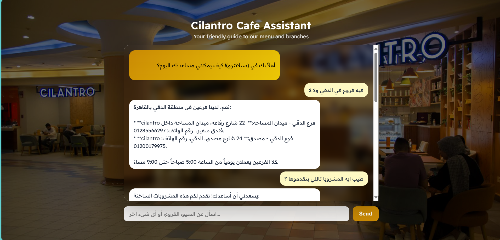
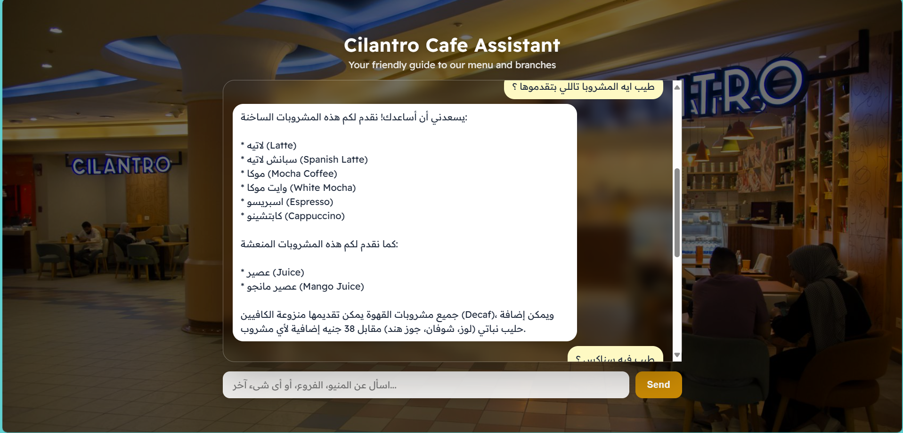
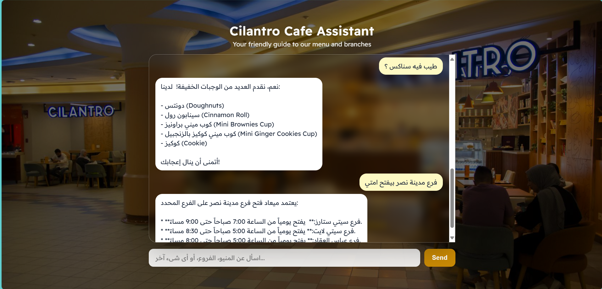

## Customer Support RAG System

Delightfully fast, production-ready Retrieval-Augmented Generation for cafe-style customer support. Built with a clean architecture for ingestion, processing, retrieval, and generation — and a pragmatic memory strategy that preserves answer quality.

### Highlights
- Consistently accurate answers with natural multi-turn memory.
- Split responsibilities into two assistants — one for conversational context, one for factual retrieval — to avoid quality regressions when adding memory.
- Improving `k_retrieval` from 3 to 10 increased context recall from 0.975 → 1.000 while maintaining high faithfulness (0.975) and answer relevancy (0.955). See `src/evaluation/observation.txt`.

---

### Tech Stack
- FastAPI, Uvicorn
- LangChain Core and Runnables
- Google Generative AI (`gemini-1.5-flash`) for generation
- Pinecone for vector search
- HuggingFace Embeddings (`intfloat/multilingual-e5-small`)
- Jinja2 (templates) + vanilla CSS for the UI
- dotenv for configuration
- Optional: LangSmith for tracing and evaluation tracking

---

### Live Demo

<div align="center">

<table>
  <tr>
    <td align="center">
      
      <br/>
      <sub>Clean landing page with immediate query input</sub>
    </td>
    <td align="center">
      
      <br/>
      <sub>Contextualized question → High-fidelity RAG answer</sub>
    </td>
  </tr>
  <tr>
    <td align="center" colspan="2">
      
      <br/>
      <sub>Complete, structured answers rendered as Markdown bullet points</sub>
    </td>
  </tr>
  
</table>

<p>
  <em>Accurate, fast, and production-ready — designed for delightful customer support.</em>
  <br/>
  <sub>Multi‑turn memory with a specialist contextualizer preserves retrieval precision.</sub>
  
</p>

</div>

---

### The Problem We Hit When Adding “Memory”
Our base system (without memory) performed excellently. For direct questions like “What desserts do you have?”, answers were complete and well-structured.

When we bolted on a naive memory layer, the system started acting like an overloaded agent trying to both remember and retrieve at the same time. On a clear first-turn question, it sometimes over-corrected based on “imagined prior context,” issuing an impoverished search term like just “desserts,” and returning an incomplete list (sometimes only one item instead of all available options).

---

### The Smart Fix: Specialist Assistants
We separated concerns instead of overloading one model:

1) Context Assistant
- Focus: Understand prior turns and decide whether the new user message is context-dependent.
- If yes, it rewrites the message into a fully specified question.
- If the new message is already clear, it passes it through untouched.

2) Knowledge Assistant (High-precision RAG)
- Focus: Always receives a clear, unambiguous question (either the original or the rewritten one) and retrieves the best structured answer.

This preserves the strong retrieval quality of the base system while enabling natural, multi-turn conversations.

---

### Why k_retrieval = 10 (and not 3)
From `src/evaluation/observation.txt`:

```text
--------- k_retrival == 3 -----------
faithfulness         0.950
answer_relevancy     0.950
context_precision    0.917
context_recall       0.975

--------- k_retrival == 10 -----------
faithfulness         0.975
answer_relevancy     0.955
context_precision    0.911
context_recall       1.000
```

Operational intuition: in categories like drinks where we have ~10 items, returning only 3 contexts can truncate the final answer when users ask “What drinks do you have?”. With `k=10`, recall hits 1.000 and answers become complete without sacrificing faithfulness.

---

### Quickstart

Requirements are managed with `uv` (or use `pip` if you prefer):

```bash
# Using uv (fast Python package manager)
uv sync
uv run python -m src.jobs.build_index --path src/data/processed/all_documents.json --index_name customer-support-rag-system
uv run python src/app.py

# Or using pip
pip install -r requirements.txt
python -m src.jobs.build_index --path src/data/processed/all_documents.json --index_name customer-support-rag-system
python src/app.py
```

Environment configuration lives in `src/config.py`. The main web entrypoint is `src/app.py` with templates under `src/templates` and static assets under `src/static`.

Important:
- Build the Pinecone index offline before starting the API. The server now connects to an existing index and will fail fast if not found.
- Required env vars are validated at startup.

#### Environment Variables
Create a `.env` file in the project root:

```bash
PINECONE_API_KEY=your_pinecone_key
GOOGLE_API_KEY=your_google_api_key

# Optional LangSmith tracing
LANGCHAIN_TRACING_V2=true
LANGCHAIN_ENDPOINT=https://api.smith.langchain.com
LANGCHAIN_API_KEY=your_langsmith_key
LANGCHAIN_PROJECT=customer-support-rag
```

Then run with `uv run python src/app.py` or `python src/app.py`.

#### Run locally with Uvicorn (dev)

Hot-reload server on port 8000:

```bash
# Using uv (after building the index)
uv run uvicorn src.app:app --reload --host 0.0.0.0 --port 8000

# Or plain (after building the index)
uvicorn src.app:app --reload --host 0.0.0.0 --port 8000
```

#### Enable LangSmith Tracing
With the env vars above set, LangChain will automatically send traces. You can also set them temporarily for a single run:

```bash
export LANGCHAIN_TRACING_V2=true
export LANGCHAIN_API_KEY=...
export LANGCHAIN_PROJECT=customer-support-rag
uv run python src/app.py
```

---

### Docker
This repo includes a production-ready `Dockerfile` (Gunicorn + Uvicorn worker binding to port 8080). Ensure the Pinecone index is built before starting the container.

Build the image:

```bash
docker build -t cilantro-rag-app .
```

Run the container locally (map host 8000 → container 8080):

```bash
docker run -p 8000:8080 cilantro-rag-app

# Provide required env vars
docker run -p 8000:8080 \
  -e PINECONE_API_KEY=*** \
  -e GOOGLE_API_KEY=*** \
  cilantro-rag-app
```

---

### Project Structure

```text
src/
  ingestion/        # Data loaders
  processing/       # Chunking, metadata helpers
  vectorstore/      # Embeddings & Pinecone connectors
  retrieval/        # Semantic retriever (connects to existing index)
  generation/       # RAG chain composition
  jobs/             # Offline jobs (e.g., build Pinecone index)
  evaluation/       # Metrics & experiments
  templates/        # UI templates (if used)
  static/           # CSS, images (if used)
  helpers/          # Utility scripts (e.g., data processing)
  app.py            # FastAPI app entrypoint
  config.py         # Env & constants

data/
  raw/              # Raw input JSON files
  processed/        # all_documents.json generated by processing

Dockerfile          # Production container (Gunicorn + Uvicorn worker)
requirements.txt    # Python dependencies
README.md           # Project overview and instructions
```

---

### Evaluation
Automated evaluation scripts live in `src/evaluation`. Use `evaluate.py` to benchmark faithfulness, answer relevancy, context precision, and recall across different retrieval settings. We keep result snapshots and notes in `observation.txt` to drive decisions (like setting `k_retrieval = 10`).

---

### API Usage Notes
- Conversation state is session-scoped via the `X-Session-Id` request header. Provide a stable identifier per user/session to maintain short conversation memory. If omitted, an `anonymous` session is used.
- The model used by both app and evaluation is standardized via `MODEL_NAME` in `src/config.py`.
